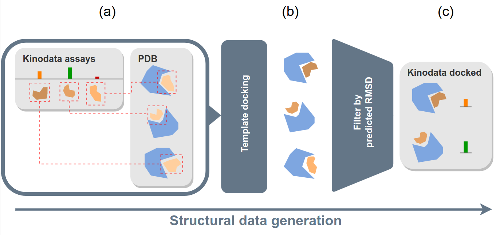

# kinodata-3D

The scripts in this repository can be used to perform template docking on the [kinodata](https://github.com/openkinome/kinodata) selection of kinase activity data mined from chembl.
They were used for the generation of the [kinodata-3D dataset](https://chemrxiv.org/engage/chemrxiv/article-details/658441f7e9ebbb4db96d98e8).

## How the docking works

The template docking process is illustrated in this figure.



It consists of three main steps: 
1. Finding similar ligands for a given kinase-ligand pair for which the binding pose is known empirically (a).
2. Performing template docking using that similar known complex as a basis (b).
3. Filtering docked complexes according to their estimated docking quality (c).

Steps 1 and 2 make heavy use of the [kinoml](http://github.com/openkinome/kinoml) framework.

Performing step 1 consists of running two scripts:
1. Finding the empirical template and
2. downloading the complex structure from [KLIFS](https://klifs.net).
These steps are performed by the scripts `pipeline/01_similar.py` and `pipeline/02_klifs_pdb.py`, respectively.
The latter step is necessary because we only use the ATP-pocket in the docking process and disregard the rest of the protein.
This pocket, we can conveniently obtain using the KLIFS REST API.

The template docking is done using `pipeline/03_run_docking.py`. This script aims to set up a large number of system threads for docking.
This way docking processes can fail for exceeding timeouts or memory limitations without crashing other docking tasks.
Limits on time and memory can be set in this script.
This scheduler calls the `pipeline/docking.py` script which contains the actual template docking steps.

The final filtering of compounds is in fact mainly the annotation of docked complexes using a simple predictive model.
This model takes analytical docking output, ie. the posit probability and the Chemgauss4 score, as well as the template similarity as inputs.
It is trained using recent re-docking benchmark data by [Schaller et al](https://www.biorxiv.org/content/10.1101/2023.09.11.557138v1).

## Setting up the environment

The environment can be set up using mamba or conda. To do this run the following command

```
mamba env create -f env.yml
```
