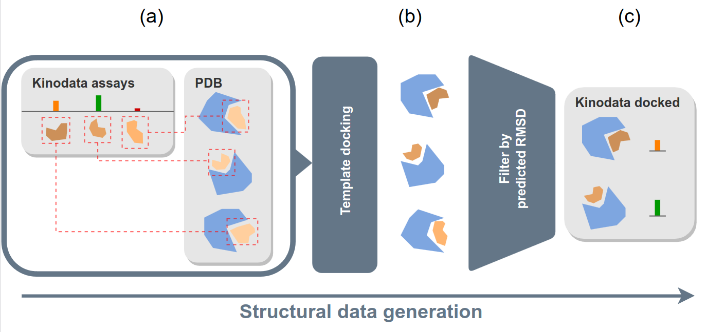

# kinodata-3D

The scripts in this repository can be used to perform template docking on the [kinodata](https://github.com/openkinome/kinodata) selection of kinase activity data mined from chembl.
They were used for the generation of the [kinodata-3D dataset](https://chemrxiv.org/engage/chemrxiv/article-details/658441f7e9ebbb4db96d98e8).

## How the docking works

The template docking process is illustrated in this figure.



It consists of three main steps: 
1. Finding similar ligands for a given kinase-ligand pair for which the binding pose is known empirically (a).
2. Performing template docking using that similar known complex as a basis (b).
3. Filtering docked complexes according to their estimated docking quality (c).

Step 2 makes use of the [kinoml](http://github.com/openkinome/kinoml) framework.

Performing step 1 consists of running two scripts:
1. Finding the empirical template and
2. downloading the complex structure from [KLIFS](https://klifs.net).
These steps are performed by the script `pipeline/klifs_template.py`.
To call this script, download the latest kinase activities as curated by [kinodata](https://github.com/openkinome/kinodata/releases).

The template docking is done using `pipeline/docking.py`. For running the docking and monitoring timeouts as well as memory usage, we make use of HTCondor. The corresponding job is defined in `pipeline/docking.sub`.

The final filtering of compounds is in fact mainly the annotation of docked complexes using a simple predictive model.
This model takes analytical docking output, ie. the posit probability and the Chemgauss4 score, as well as the template similarity as inputs.
It is trained using recent re-docking benchmark data by [Schaller et al](https://www.biorxiv.org/content/10.1101/2023.09.11.557138v1).
The model and code can be found in `notebooks/rmsd_prediction.ipynb` and `notebooks/simple_nn_model.pth`, respectively.

## Setting up the environment

The environment can be set up using mamba or conda. To do this run the following command

```
mamba env create -f env.yml
```
